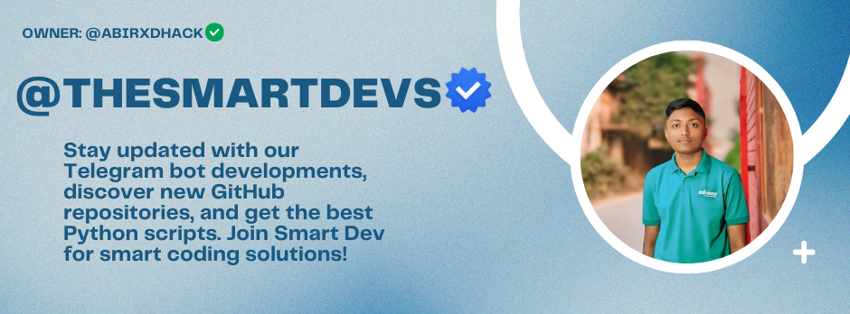

# Smart Dev 

  
  
  

    
    
    
    
    
  

## 🚀 About The Smart Dev
Smart Dev is a forward-thinking organization dedicated to delivering intelligent coding solutions led by [@abirxdhack](https://github.com/abirxdhack). We specialize in Telegram bot development, GitHub repository exploration, and creating high-quality Python scripts that help developers and organizations achieve their technical goals efficiently.

  
  
  
  

---

## 🌟 Our Featured Projects

  <table>
    <tr>
      <td align="center">
        <a href="https://github.com/abirxdhack/SmartUtilBot">
          
           
          🤖 Advanced Telegram Bot
        </a>
      </td>
      <td align="center">
        <a href="https://github.com/abirxdhack/SmartUtilDocs">
          
           
          📚 Comprehensive Documentation
        </a>
      </td>
      <td align="center">
        <a href="https://github.com/abirxdhack/SmartDevStats">
          
           
          📊 GitHub Analytics Tool
        </a>
      </td>
    </tr>
    <tr>
      <td align="center">
        <a href="https://github.com/abirxdhack/SmartAI">
          
           
          🧠 AI-Powered Tools
        </a>
      </td>
      <td align="center">
        <a href="https://github.com/abirxdhack/Insta-Scrapper-API">
          
           
          📸 Instagram Data API
        </a>
      </td>
      <td align="center">
        <a href="https://github.com/abirxdhack/FacebookAPI">
          
           
          Facebook DL API 
        </a>
      </td>
    </tr>
  </table>

### **1. [SmartUtilBot](https://github.com/abirxdhack/SmartUtilBot)** 
> A powerful Telegram bot for productivity and automation.
- 🤖 Automate repetitive tasks with smart workflows
- 🌐 Manage notifications and alerts across platforms
- 🔧 Built with Python, Telegram API, and async processing
- 📱 Cross-platform compatibility
- 🔐 Enterprise-grade security protocols

### **2. [SmartUtilDocs](https://github.com/abirxdhack/SmartUtilDocs)** 
> Comprehensive documentation for Smart Dev tools and projects.
- 📚 Developer-friendly guides with step-by-step instructions
- 🛠️ Interactive code examples and sandboxes
- 🔗 Complete API references with usage examples
- 🖥️ Responsive design optimized for all devices
- 🔄 Continuously updated with latest features

### **3. [SmartDevStats](https://github.com/abirxdhack/SmartDevStats)** 
> A GitHub stats analytics tool for developers.
- 📊 Advanced visualization of repository performance
- 📈 Predictive analytics for repository growth trends
- 🔍 Competitor analysis and benchmarking tools
- 📑 Exportable reports in multiple formats
- 🔄 Real-time data synchronization

### **4. [SmartAI](https://github.com/abirxdhack/SmartAI)**
> AI-powered tools for enhanced productivity and creativity.
- 🧠 State-of-the-art machine learning algorithms
- 🚀 Optimized for both CPU and GPU processing
- 📝 Natural language processing capabilities
- 🎯 Specialized for data-driven decision making
- 🔄 Self-improving models with continuous learning

### **5. [Insta-Scrapper-API](https://github.com/abirxdhack/Insta-Scrapper-API)** 
> API for scraping Instagram data efficiently.
- 📸 Extract comprehensive Instagram metrics and insights
- 🔍 Advanced filtering and search capabilities
- 🔐 Compliant with platform terms of service
- 📦 Modular design for easy integration
- 🚀 High-performance, scalable architecture

### **6. [YouTubeDLBot](https://github.com/abirxdhack/YouTubeDLBot)** 
> Cloud infrastructure automation tools.
- ☁️ SuperFast YouTube Downloader
- 🔄 Infrastructure as Code (IaC) templates
- 🔒 Security-first configuration patterns
- 💰 Cost optimization strategies
- 🔍 Performance monitoring integrations

---

## 💻 Technology Stack

  
  ### Our Basic Programming Languages
  
  
  
  
  
  
  
  
  
  ### Our Frontend Development
  
  
  
  
  
  
  
  
  ### Our Backend Development
  
  
  
  
  
  
  
  ### Our Database Technologies
  
  
  
  
  
  
  ### Our AI & Data Science
  
  
  
  
  
  
  ### Our DevOps & Tools
  
  
  
  
  
  
  
  
  

---
## 📊 Core Developer  GitHub Analytics

  
  
  
    
  
  
  
    
  
  
  

---

### Support Our Work
If you find our projects helpful, consider supporting us:

  
  
  
  
  

---

## 📬 Connect With Us

  
  
  
  
  
  
  
  

---

  <h3>⭐ Star Our Repositories</h3>
  
If you find our projects helpful, please consider giving them a star! It helps us know what's valuable to the community.

  
  

